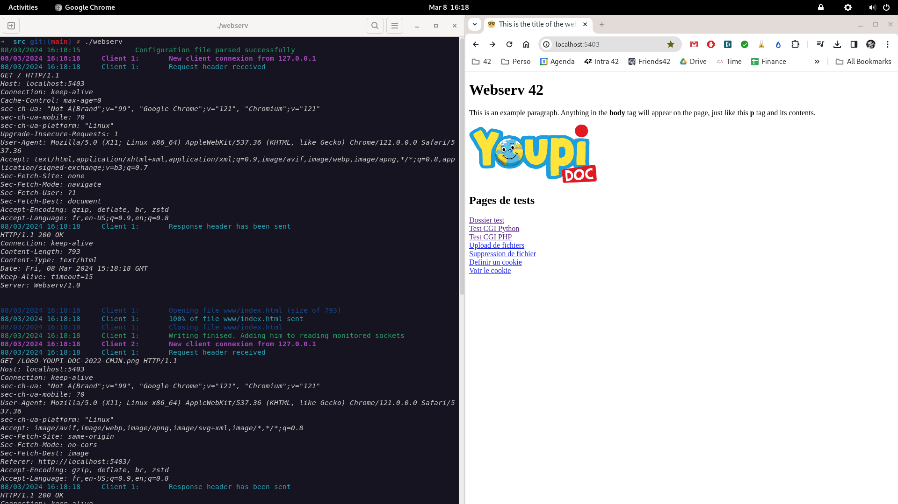

# Webserv

In this project, we created our own webserver in C++. I did this project with [lanzaj](https://github.com/lanzaj) et [Tibobobo](https://github.com/Tibobobo)

## Main notions developed in the project
- Asynch coding
- Parsing of HTTP Requests
- Creation of HTTP Responses

## Launch the program :

```
$> cd src
$> make && ./webserv
```

## Example of the program runing

